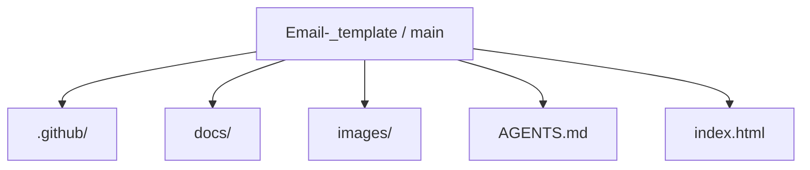
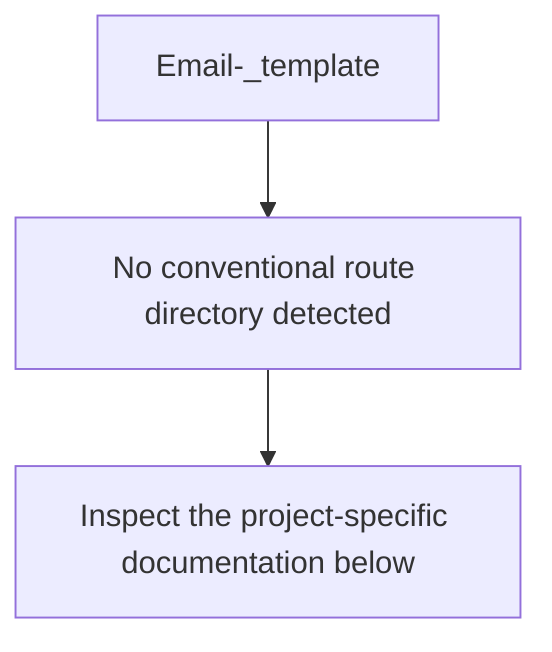
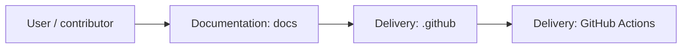
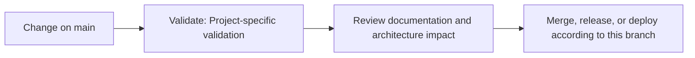

# Email Template

<!-- interactive-readme-standard:start -->

> [!NOTE]
> **Branch-specific documentation:** this section is maintained for [`main`](https://github.com/Nischhalsubba/Email-_template/tree/main). It is generated from the files present on this branch and preserves the project-authored README below.

<strong>Interactive repository guide</strong>

## Branch overview

| Item | Value |
|---|---|
| Repository | [`Nischhalsubba/Email-_template`](https://github.com/Nischhalsubba/Email-_template) |
| Branch | [`main`](https://github.com/Nischhalsubba/Email-_template/tree/main) |
| Detected stack | HTML |
| Detected manifests | No standard manifest detected |
| Documentation policy | Every maintained branch must explain purpose, setup, structure, architecture, flows, testing, delivery, security, and ownership. |

## Repository structure

The diagram is generated from the branch's actual top-level files and directories. Use the branch link above for complete source navigation.

## Website or application structure

## Application and responsibility flow

## Change-to-delivery flow

## README requirements for this branch

- Explain what this branch contains and how it differs from the default branch.
- Keep installation, configuration, usage, testing, deployment, security, support, and license information accurate.
- Document repository, website or application, API, data, authentication, background-job, and deployment flows when they exist.
- Prefer Mermaid diagrams and expandable `
` sections for visual navigation.
- Link diagrams and modules to real source paths; never invent missing components.
- Preserve project-specific documentation and update diagrams whenever architecture or major paths change.
- Treat secrets, private infrastructure, customer data, and credentials as prohibited README content.

<!-- interactive-readme-standard:end -->

### Static HTML Email Template Collection

**A repository for email-template design and development assets, intended for HTML email layouts, newsletter structures, responsive email components, campaign templates, and email UI experimentation.**

---

## ✨ Overview

**Email-_template** is a repository for email-template work. It can be used to organize HTML email layouts, marketing email designs, newsletter concepts, transactional email templates, and reusable email sections.

HTML email development is different from normal web development. Email clients can be inconsistent, so layouts often need simple tables, inline styles, fallback-safe typography, optimized images, and careful testing.

---

## 🎯 Project Purpose

This repo can support:

- newsletter email templates
- promotional email campaigns
- transactional email layouts
- reusable email components
- client-ready email previews
- static email design experiments

---

## 🎨 Designer’s Perspective

A good email template should be clear, scannable, and action-focused.

Design priorities:

- strong headline
- clear CTA
- readable body copy
- simple visual hierarchy
- responsive mobile layout
- brand-safe colors and spacing
- tested rendering across email clients

---

## 🧱 Suggested Template Sections

| Section | Purpose |
|---|---|
| Header | Logo and brand recognition |
| Hero | Main message or campaign offer |
| Body | Details, story, or product content |
| CTA | Primary action |
| Supporting Blocks | Features, articles, products, or updates |
| Footer | Social links, unsubscribe, address/legal text |

---

## ✅ Email QA Checklist

- [ ] Test in Gmail.
- [ ] Test in Outlook.
- [ ] Test in Apple Mail.
- [ ] Test mobile width.
- [ ] Use inline CSS where required.
- [ ] Add alt text to images.
- [ ] Optimize image size.
- [ ] Check CTA link.
- [ ] Include unsubscribe/legal footer if used for campaigns.

---

## 🚀 Usage

Open the HTML email file in a browser for quick preview, then test it in real email clients or a tool like Litmus, Email on Acid, Mailchimp preview, or your email platform’s test-send feature.

---

## 🗺 Roadmap

- Add preview screenshots.
- Add individual template documentation.
- Add responsive email testing notes.
- Add reusable components.
- Add campaign examples.
- Add dark-mode email notes.

---

A practical space for building and organizing polished HTML email templates.

