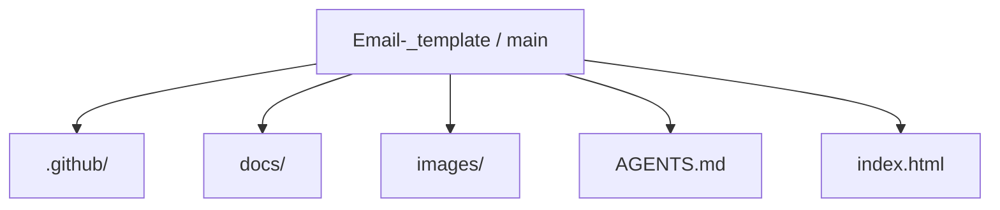
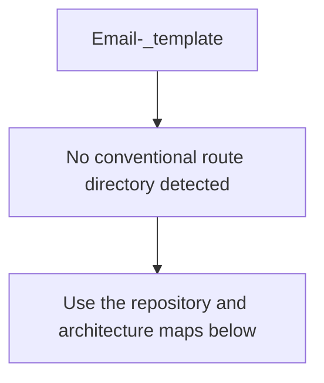
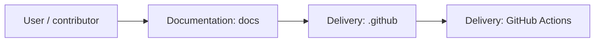
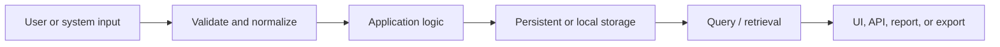
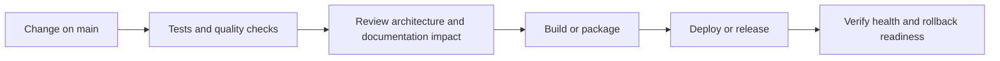
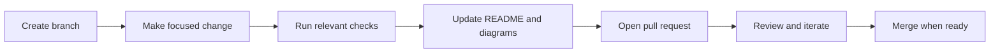

<!-- interactive-readme-standard:start -->

# Email-_template

**Branch-aware technical guide for [`main`](https://github.com/Nischhalsubba/Email-_template/tree/main)**

  

  <a href="https://github.com/Nischhalsubba/Email-_template/tree/main"><strong>Browse source</strong></a> ·
  <a href="https://github.com/Nischhalsubba/Email-_template/issues"><strong>Issues</strong></a> ·
  <a href="https://github.com/Nischhalsubba/Email-_template/codespaces/new?ref=main"><strong>Open in Codespaces</strong></a>

> [!IMPORTANT]
> This guide is generated from the files actually present on `main`. It links to detected source paths, preserves project-authored notes, and avoids claiming components that were not found.

## At a glance

| Item | Detected value |
|---|---|
| Purpose | A HTML project documented from the current branch structure and manifests. |
| Branch role | Default branch |
| Stack | HTML |
| Manifests | No standard manifest detected |
| Prerequisites | Confirm from the detected manifests |
| Delivery | GitHub Actions |
| License | No license file detected |

## Branch scope

This is the repository's default branch.

## Quick start

> No reliable setup command was detected. Use the preserved project-authored notes and manifests rather than guessing.

### Configuration surface

- No committed environment example file was detected.

> Never commit secrets, private keys, production credentials, customer data, or unredacted infrastructure details.

## Repository map

| Responsibility | Detected source paths |
|---|---|
| Documentation | [`docs`](https://github.com/Nischhalsubba/Email-_template/tree/main/docs) |
| Delivery | [`.github`](https://github.com/Nischhalsubba/Email-_template/tree/main/.github) |

## Website or application map

## Architecture and responsibility flow

<strong>Data flow and model surface</strong>

Detected data areas: [`images/migration.png`](https://github.com/Nischhalsubba/Email-_template/blob/main/images/migration.png).

## Quality, security, and operations

<table>
<tr>
<td width="33%" valign="top">

### Quality

- No conventional test directory was detected automatically.

Detected commands:
- No standard quality command detected.

</td>
<td width="33%" valign="top">

### Security

- No dedicated security policy or automated dependency configuration was detected.

Review authentication, authorization, input validation, dependency updates, secret handling, and failure recovery before release.

</td>
<td width="34%" valign="top">

### Observability

- No dedicated observability integration was detected automatically.

Define useful logs, metrics, traces, alerts, and rollback signals for production-facing branches.

</td>
</tr>
</table>

## Delivery flow

### Automation detected

- [`.github/workflows/apply-interactive-readme.yml`](https://github.com/Nischhalsubba/Email-_template/blob/main/.github/workflows/apply-interactive-readme.yml)

## Contribution flow

- Keep changes focused and explain architectural consequences.
- Run the checks relevant to the changed area.
- Update diagrams whenever routes, modules, data models, authentication, jobs, or delivery paths change.
- Add screenshots or recordings for visual behavior changes when useful.
- Use issues for reproducible defects and pull requests for reviewable changes.

## Ownership and support

| Topic | Source |
|---|---|
| Repository | [`Nischhalsubba/Email-_template`](https://github.com/Nischhalsubba/Email-_template) |
| Branch | [`main`](https://github.com/Nischhalsubba/Email-_template/tree/main) |
| Ownership | No CODEOWNERS file detected |
| Contributing | Use the contribution flow above |
| Support | [Open or review issues](https://github.com/Nischhalsubba/Email-_template/issues) |
| License | No license file detected |

<strong>Documentation maintenance checklist</strong>

- [ ] Purpose and branch scope are accurate.
- [ ] Setup and configuration commands still work.
- [ ] Repository, application, API, data, authentication, job, and deployment diagrams match the code.
- [ ] Tests, security controls, observability, and rollback behavior are documented.
- [ ] Links point to real files on this branch.
- [ ] No secrets or private operational details are exposed.

<!-- interactive-readme-standard:end -->

<!-- project-authored-notes:start -->

<strong>Project-authored notes preserved from this branch</strong>

# Email Template

### Static HTML Email Template Collection

**A repository for email-template design and development assets, intended for HTML email layouts, newsletter structures, responsive email components, campaign templates, and email UI experimentation.**

---

## ✨ Overview

**Email-_template** is a repository for email-template work. It can be used to organize HTML email layouts, marketing email designs, newsletter concepts, transactional email templates, and reusable email sections.

HTML email development is different from normal web development. Email clients can be inconsistent, so layouts often need simple tables, inline styles, fallback-safe typography, optimized images, and careful testing.

---

## 🎯 Project Purpose

This repo can support:

- newsletter email templates
- promotional email campaigns
- transactional email layouts
- reusable email components
- client-ready email previews
- static email design experiments

---

## 🎨 Designer’s Perspective

A good email template should be clear, scannable, and action-focused.

Design priorities:

- strong headline
- clear CTA
- readable body copy
- simple visual hierarchy
- responsive mobile layout
- brand-safe colors and spacing
- tested rendering across email clients

---

## 🧱 Suggested Template Sections

| Section | Purpose |
|---|---|
| Header | Logo and brand recognition |
| Hero | Main message or campaign offer |
| Body | Details, story, or product content |
| CTA | Primary action |
| Supporting Blocks | Features, articles, products, or updates |
| Footer | Social links, unsubscribe, address/legal text |

---

## ✅ Email QA Checklist

- [ ] Test in Gmail.
- [ ] Test in Outlook.
- [ ] Test in Apple Mail.
- [ ] Test mobile width.
- [ ] Use inline CSS where required.
- [ ] Add alt text to images.
- [ ] Optimize image size.
- [ ] Check CTA link.
- [ ] Include unsubscribe/legal footer if used for campaigns.

---

## 🚀 Usage

Open the HTML email file in a browser for quick preview, then test it in real email clients or a tool like Litmus, Email on Acid, Mailchimp preview, or your email platform’s test-send feature.

---

## 🗺 Roadmap

- Add preview screenshots.
- Add individual template documentation.
- Add responsive email testing notes.
- Add reusable components.
- Add campaign examples.
- Add dark-mode email notes.

---

A practical space for building and organizing polished HTML email templates.

<!-- project-authored-notes:end -->
