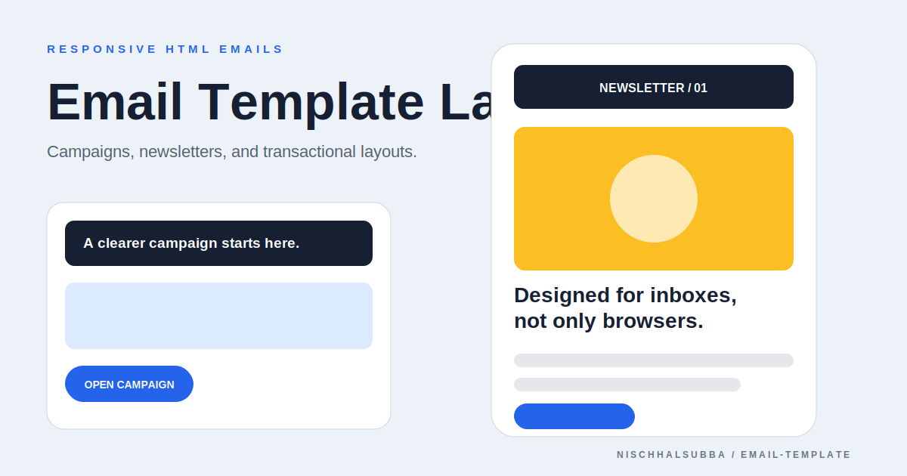

# Email Template Repository Overview

## Classification

A static collection for responsive HTML email experiments, newsletters, campaigns, and transactional layouts.

- Browser preview is only an approximation of email-client rendering.
- Real QA requires test sends in Gmail, Outlook, Apple Mail, and mobile clients.
- Fresh browser screenshot was not captured because public hosts were unreachable.
- The image above is a designed repository thumbnail, not an inbox screenshot.

## Quality priorities

1. Document each template and intended use.
2. Keep critical styles inline or verify the sending platform performs inlining.
3. Use table-based layout where client compatibility requires it.
4. Add plain-text alternatives, alt text, unsubscribe details, and physical-address/legal content where applicable.
5. Test dark mode, blocked images, narrow screens, and long copy.